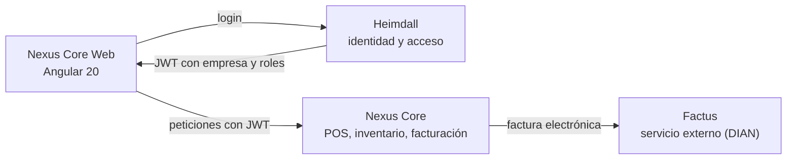

# Daniel Felipe Gómez Ferreira

Java Full Stack Developer con foco en backend: Java, Spring Boot y microservicios, con Angular y React en el frontend. Más de 2 años construyendo APIs REST y aplicaciones web de punta a punta.

## Nexus

SaaS multi-tenant de punto de venta (POS), inventario y facturación electrónica para pequeños negocios en Colombia. Es un producto propio que diseñé y desarrollé como único desarrollador. El código es privado.

Los problemas técnicos que resolví:

- **Emisión sin facturas duplicadas.** La factura se guarda como pendiente antes de llamar a Factus, la llamada HTTP se hace fuera de la transacción y el resultado se registra en una segunda. Índices únicos impiden la doble emisión ante un doble clic o un fallo de red.
- **Sin sobreventa de stock.** Bloqueo pesimista de productos en ventas simultáneas.
- **Credenciales por empresa.** Las credenciales de Factus de cada empresa se cifran con AES-256-GCM, ligadas al id de la empresa.
- **Aislamiento multi-tenant.** Heimdall emite el JWT con empresa y roles; Nexus Core lo valida y filtra cada consulta por empresa.

La integración con Factus está validada en su ambiente de pruebas.

Stack: Java 21, Spring Boot, Spring Security, JPA/Hibernate, PostgreSQL, Flyway, Angular 20, TypeScript, Docker. Desplegado en Render, Vercel y Supabase.

## Proyectos públicos

- **[Jarvis](https://github.com/danielgomez-engineer/jarvis)**: gestor de tareas con autenticación, hecho para practicar Next.js de punta a punta. Sesión con JWT en cookie httpOnly, rutas protegidas en el servidor y API que filtra cada consulta por el usuario del token. [Demo](https://jarvis-azure-eta.vercel.app)

## Stack

- **Backend:** Java 21, Spring Boot, Spring Security, JPA/Hibernate, microservicios, API REST, JWT, JUnit, Node.js
- **Frontend:** Angular, React, TypeScript, JavaScript, Next.js, HTML5, CSS3, Tailwind CSS
- **Bases de datos:** PostgreSQL, MySQL, SQL, Flyway, Prisma
- **Herramientas:** Docker, Git, GitHub, Azure DevOps, Jira, JasperReports, Maven, Gradle, Scrum
- **En formación:** Python, FastAPI, análisis de datos y machine learning

## Formación

- Ingeniería de Sistemas (UNAD)
- Especialización en Ciencia de Datos y Analítica (UNAD), en curso

## Contacto

- LinkedIn: [linkedin.com/in/danielgomez-dev](https://www.linkedin.com/in/danielgomez-dev)
- Correo: [danielf23.dev@gmail.com](mailto:danielf23.dev@gmail.com)
